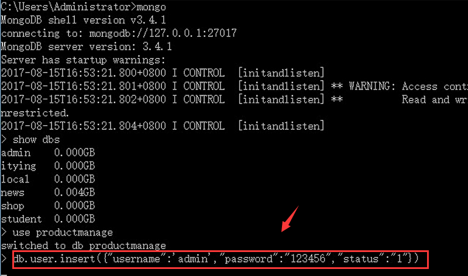

## 查询mongodb数据库登录功能

### 创建数据库

1.打开数据库

2.需要创建`productmanage`数据库

3.`productmanage`	数据库里面有user表

4.在`user`表中有数据  ,如果没有执行如下命令插入

`db.user.insert({"username":"admin","password":"123456"})`

如图：



### 连接数据库

继续在app.js文件中添加如下代码：

```js
//安装body-parser中间件
//获取post
var bodyParser = require('body-parser');
// 设置body-parser中间件
app.use(bodyParser.urlencoded({ extended: false }));
app.use(bodyParser.json());

//数据库操作
var MongoClient=require('mongodb').MongoClient;

var DbUrl='mongodb://localhost:27017/productmanage';  /*连接数据库*/


//登录
app.get('/login',function(req,res){
    res.render('login');
})

//获取登录提交的数据
app.post('/doLogin',function(req,res){

    //1.获取数据
    //2.连接数据库查询数据
    MongoClient.connect(DbUrl,function(err,db){
        if(err){
            console.log(err);
            return;
        }

        //查询数据  {"username":req.body.username,"password":req.body.password}
        var result=db.collection('user').find(req.body);

        //遍历数据的方法
        result.toArray(function(err,data){
            console.log(data);

            if(data.length>0){
                console.log('登录成功');

                //保存用户信息
                req.session.userinfo=data[0];
                res.redirect('/product');  /*登录成功跳转到商品列表*/
            }else{
                //console.log('登录失败');
                res.send("<script>alert('登录失败');location.href='/login'</script>");
            }
            db.close();
        })
    })
})
```
### 登录页面

在views/login.ejs页面键入以下代码：

**views/login.ejs**

```ejs
<!DOCTYPE HTML PUBLIC "-//W3C//DTD HTML 4.01 Transitional//EN" "http://www.w3.org/TR/html4/loose.dtd">
<html>
<head>
    <title>用户登录</title>
    <link rel="stylesheet" href="bootstrap/css/bootstrap.min.css">
    <link rel="stylesheet" href="css/login.css">
    <link rel="stylesheet" href="css/basic.css">
    <script src="bootstrap/js/jquery-1.10.1.js"></script>
    <script src="bootstrap/js/bootstrap.js"></script>
</head>
<body>
  <div class="container">
      <div class="row">
          <div class="col-md-offset-3 col-md-6">
              <form class="form-horizontal" action="/doLogin" method="post">
                  <span class="heading">用户登录</span>
                  <div class="form-group">
                      <input type="text" name="username" class="form-control" id="inputEmail3" placeholder="用户名">
                      <i class="fa fa-user"></i>
                  </div>
                  <div class="form-group help">
                      <input type="password"  name="password" class="form-control" id="inputPassword3" placeholder="密　码">
                      <i class="fa fa-lock"></i>
                      <a href="#" class="fa fa-question-circle"></a>
                  </div>
                  <div class="form-group">
                      <div class="main-checkbox">
                          <input type="checkbox" value="None" id="checkbox1" name="check"/>
                          <label for="checkbox1"></label>
                      </div>
                      <span class="text">Remember me</span>
                      <button type="submit" class="btn btn-default">登录</button>
                  </div>
              </form>
          </div>
      </div>
  </div>
</body>
</html>
```
