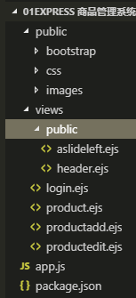

# 框架搭建
## 目录结构


对应文件及文件夹的用处：

1. `public`: 存放静态文件，如样式、图片等
2. `views`: 存放模板文件
3. `app.js`: 程序主文件
4. `package.json`: 存储项目名、描述、作者、依赖等等信息

## 安装依赖模块 

运行以下命令安装所需模块：

```sh
npm install express ejs --save-dev
```

新建app.js文件，并输入以下代码：

```js
//安装express
//安装ejs
var express=require('express');
var app=new express();  /*实例化*/

//使用ejs模板引擎   默认找views这个目录
app.set('view engine','ejs');

//配置public目录为我们的静态资源目录
app.use(express.static('public'));

app.get('/',function(req,res){
    res.send('index');
})

//登录
app.get('/login',function(req,res){
    //res.send('login');

    res.render('login');
})

app.get('/product',function(req,res){
    res.render('product');
})

app.get('/productadd',function(req,res){
    res.render('productadd');
})

app.get('/productedit',function(req,res){
    res.render('productedit');
})

app.get('/productdelete',function(req,res){
    res.send('productdelete');
})

app.listen(3003,'127.0.0.1');
```

在终端中输入命令运行项目：

```sh
node app.js
```

这样一个静态的node框架就搭建完成了。
